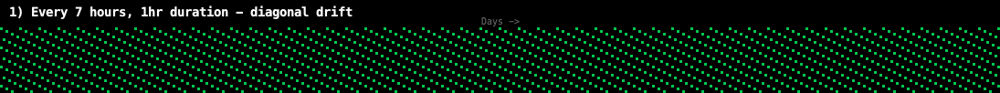
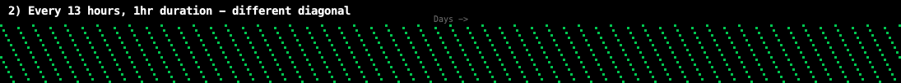
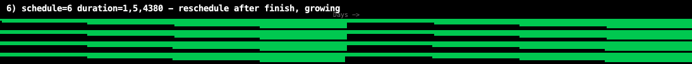
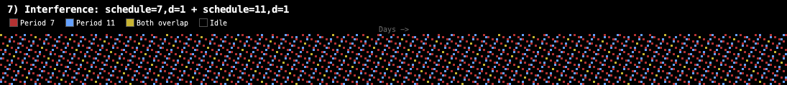
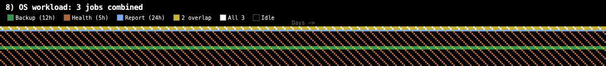
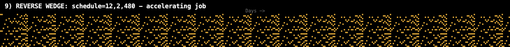

# LiquiMaps: Visualizing Periodic Job Scheduling

## What is a LiquiMap?

A LiquiMap is a pixel-based visualization that maps **every hour of an entire year** onto a 2D grid:

- **Rows (Y-axis):** 24 hours of the day (0-23, top to bottom)
- **Columns (X-axis):** 365 days of the year (left to right)
- **Each pixel** = 1 hour. Blue = job running, black = idle.
- **Total:** 24 x 365 = 8,760 pixels representing a full year at hourly resolution.

The name "LiquiMaps" comes from how the patterns seem to *flow* across the image when job durations grow or schedules shift over time.

## How the Program Works

The program simulates jobs that:
1. **Run** for a specified duration (in hours)
2. **Reschedule** themselves after completing (wait N hours, then run again)
3. **Optionally change** their schedule or duration over time via linear interpolation

The key insight: jobs reschedule based on *when they finish*, not on a fixed wall-clock schedule. This is how real batch processes behave: "run the backup, then wait 6 hours and run it again."

### Parameter Format

```
schedule=<period>               # Fixed: run every N hours
schedule=<start>,<end>,<range>  # Transition: linearly change period over <range> hours
duration=<hours>                # Fixed: job runs for N hours
duration=<start>,<end>,<range>  # Transition: linearly change duration over <range> hours
```

---

## The Patterns

### 1. Diagonal Drift: `schedule=7, duration=1`



**What you see:** Parallel diagonal stripes running from upper-left to lower-right.

**Why it happens:** A job that runs every 7 hours starts 7 hours later each cycle. Since a day has 24 hours, after each day the job has shifted by 7 mod 24 = 7 hours. This creates a consistent diagonal. The slope of the diagonal directly encodes the ratio of the period to the day length.

**Real-world analogy:** A medication that must be taken every 7 hours will drift through different times of day. A cron job running every 7 hours on a machine creates exactly this pattern in system logs.

---

### 2. Different Diagonal: `schedule=13, duration=1`



**What you see:** A different diagonal angle than #1, with wider spacing between stripes.

**Why it matters:** You can visually *identify* a job's period just by looking at its stripe angle. Period 7 and period 13 create distinctly different fingerprints. If you overlaid real system data onto this grid, anomalies would immediately stand out as breaks in the diagonal.

---

### 3. The Wedge: `schedule=1,4,240 duration=1`


**What you see:** Repeating fan/wedge shapes. The pattern starts dense (nearly every hour is blue) and progressively spreads out, then resets.

**Why it happens:** The schedule linearly transitions from every 1 hour to every 4 hours over a 240-hour (10-day) window, then resets and repeats. As the gap between runs increases, the blue pixels thin out, creating a spreading wedge shape that repeats across the year.

**Real-world analogy:** A system that increases polling intervals under load (backoff). Starting at 1-second polling and ramping to 4-second polling over a 10-day window would produce this exact signature in monitoring data.

---

### 4. Wider Wedge: `schedule=2,8,480 duration=1`


**What you see:** More dramatic sawtooth/wedge shapes with clear diagonal fan-outs and visible repeating periods.

**Why it happens:** Same principle as #3, but the wider range (2 to 8 hours) and longer transition (480 hours = 20 days) creates a more visible pattern. You can clearly see the repeating cycles as the job slows down then snaps back to its fast period.

---

### 5. Growing Duration: `schedule=7, duration=1,7,8760`


**What you see:** Diagonal stripes that start thin on the left and gradually widen across the entire year until they fill most of the space on the right.

**Why it happens:** The job runs every 7 hours (constant schedule) but its duration grows linearly from 1 hour to 7 hours across all 8,760 hours of the year. By year's end, the job runs for 7 hours out of every 7 — meaning it's running essentially 100% of the time.

**Real-world analogy:** This is the classic "slowly degrading batch process" pattern. A nightly report that took 1 hour in January is taking 7 hours by December due to growing data volume or unoptimized queries. In production monitoring, this pattern is a clear signal that something needs attention before it starts missing its scheduling window.

---

### 6. Reschedule After Finish + Growing Duration: `schedule=6, duration=1,5,4380`



**What you see:** Horizontal bands that start thin with gaps, then progressively widen and merge until the blue dominates. The pattern "floods" from left to right.

**Why it happens:** The job reschedules 6 hours after it *finishes* (not after it starts). As the duration grows from 1 to 5 hours over half the year, the total cycle (run time + 6 hour wait) stretches from 7 to 11 hours. But the *proportion* of time spent running increases dramatically — from 1/7 (14%) to 5/11 (45%).

**Real-world analogy:** A backup job that reschedules 6 hours after completion. As the data volume grows, the backup takes longer and longer, eating into the idle window. This is exactly the pattern that eventually causes "the backup is still running when the next one is supposed to start" incidents.

---

### 7. Interference Pattern: `schedule=7,d=1 + schedule=11,d=1`



**What you see:** Two overlapping diagonal stripe patterns shown in distinct colors (red and blue), with yellow highlights where both jobs run simultaneously, creating a visible moiré-like interference texture.

**Why it happens:** Two independent jobs (periods 7 and 11) overlap. Since 7 and 11 are coprime, the combined pattern has a super-period of LCM(7,11) = 77 hours before it repeats exactly. The visual texture shifts as the two stripe patterns move in and out of phase.

**Real-world analogy:** An OS running a backup every 12 hours and a virus scan every 15 hours. The two jobs occasionally collide, creating resource contention windows. The LiquiMap makes these collision patterns immediately visible.

---

### 8. OS Workload: Three Jobs Combined



**What you see:** Dense coverage with a complex repeating texture — each job shown in its own color (green, orange, blue), with yellow where two jobs overlap and white where all three coincide.

**Setup:** Three concurrent jobs:
- Every 12 hours, 2-hour duration (backup) — green
- Every 5 hours, 1-hour duration (health check) — orange
- Every 24 hours, 3-hour duration (nightly report) — blue

The composite pattern creates a realistic simulation of an OS scheduling multiple recurring tasks. The multi-color rendering shows which jobs are running and when they collide.

---

### 9. Reverse Wedge (Accelerating Job): `schedule=12,2,480`



**What you see:** Inverted wedge/curtain shapes — the pattern starts sparse and accelerates to dense before resetting.

**Why it happens:** The schedule *shrinks* from every 12 hours to every 2 hours over 480 hours. The job fires more and more frequently, filling in the black gaps, then snaps back to its lazy 12-hour schedule and repeats.

**Real-world analogy:** Auto-scaling that ramps up polling frequency during peak load. Or a monitoring system that increases check frequency when it detects anomalies, then relaxes when things stabilize.

---

### 10. Both Schedule and Duration Changing: `schedule=7,11,240 duration=1,4,480`


**What you see:** The most complex pattern — organic-looking zigzag mountain-range shapes with varying density.

**Why it happens:** Both the *how often* and *how long* are changing simultaneously but at different rates (240 vs 480 hour cycles). The interaction of these two independently varying parameters creates a rich, almost chaotic-looking pattern that nonetheless has underlying periodicity.

**Real-world analogy:** A real-world process where both the frequency and intensity change — like seasonal retail patterns where both the number of transactions and the time to process each transaction shift over different timescales.

---

## How to Run

### Spring Shell (Interactive)
```bash
mvn spring-boot:run
# Then in the shell:
r "schedule=7;duration=1"
r "schedule=1,4,240;duration=1"
r "schedule=7;duration=1;schedule=11;duration=1"
```

### Headless Image Generator
```bash
javac LiquiMapGenerator.java
java -Djava.awt.headless=true LiquiMapGenerator
```

### Script Files
The project includes bundled command scripts:
```bash
# In the Spring Shell:
script everyhour.txt
script interesting.txt
script neighbors.txt
```

## Key Takeaway

Simple periodic rules, when mapped to a 24-hour daily grid, produce surprisingly complex and beautiful visual patterns. More importantly, these patterns are *diagnostic* — you can learn to read them like an experienced radiologist reads an X-ray. A diagonal says "fixed period." A widening stripe says "growing duration." A flooding pattern says "approaching capacity." The visual language is intuitive once you know what to look for.
