# Surprise Images: Complex Patterns from Simple Math

## The Concept

The `Paints` program demonstrates a striking principle: **incredibly complex visual patterns can emerge from trivially simple mathematical operations on pixel coordinates.**

The entire program is just a nested loop over every pixel `(i, j)` in a 1000x1000 image, applying a one-line formula to decide the color. No fractals, no recursive algorithms, no complex data structures — just basic arithmetic applied to coordinates.

The code is intentionally minimal to make the point: the complexity lives in the math, not the program.

## How It Works

```java
for (int i = 0; i < WIDTH; i++) {
    for (int j = 0; j < HEIGHT; j++) {
        tile.setRGB(i, j, formula(i, j));
    }
}
```

That's it. The entire visual complexity comes from what `formula(i, j)` returns.

---

## Algorithm 0: Tangent-Based Coloring

### Formula: `(int) Math.tan(j * i)`

The tangent function converts the product of coordinates into an RGB color integer. Since `tan()` has poles (approaches infinity) at odd multiples of pi/2, the function produces wild value swings that, when truncated to integers and interpreted as RGB colors, create intricate patterns.

### Raw tangent (no modulo)

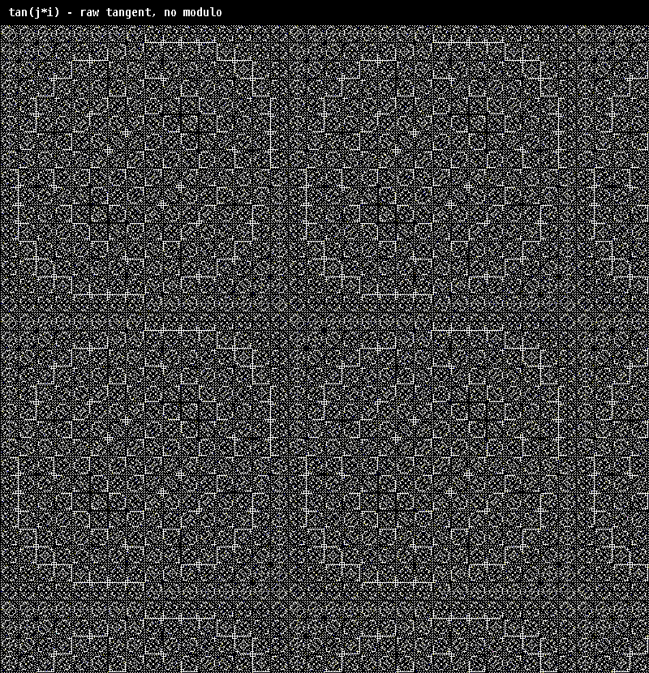

**What you see:** A complex, almost textile-like pattern with nested rectangular/diamond structures radiating from the origin. There are visible symmetries along both axes and diagonals.

**Why:** The product `j * i` creates hyperbolic contour lines (like the curves xy = constant). The tangent function then "slices" through these hyperbolas at its pole positions, creating the sharp boundaries visible in the image. The RGB color interpretation turns these into the visible pattern.

---

### tan(j*i % 10)

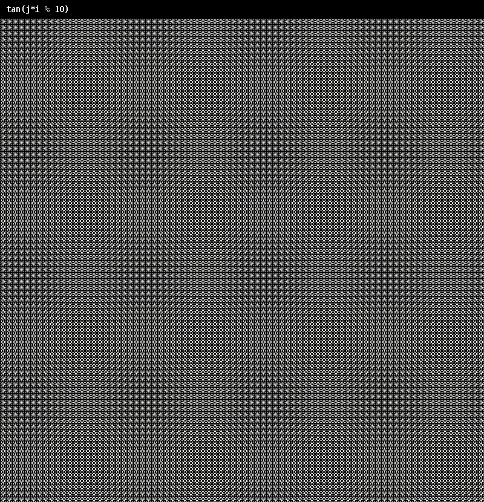

**What you see:** A regular tiled pattern with visible grid structure. The modulo constrains values to 0-9 before the tangent is applied, creating a repeating tile.

**Why:** The modulo operation wraps the product space, so the pattern tiles every 10 pixels in a way that interacts with the multiplicative structure of the coordinates.

---

### tan(j*i % 43)

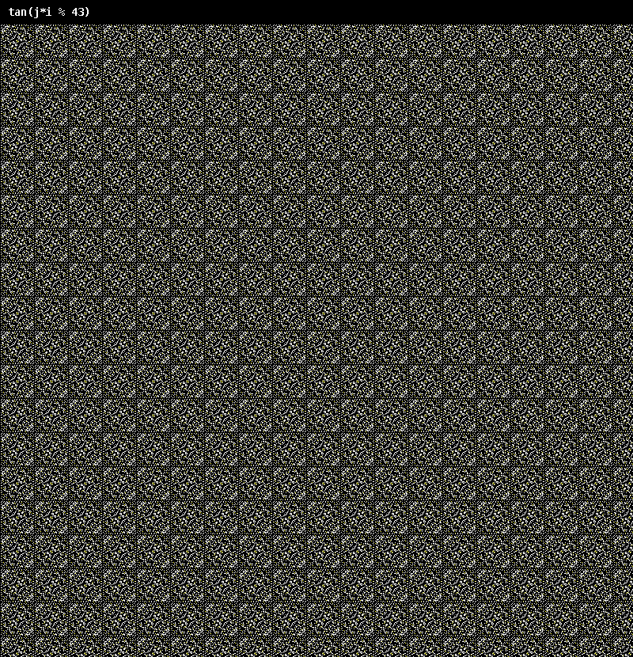

**What you see:** A richly textured pattern resembling woven fabric, with larger-scale tiling visible as shifted rectangular blocks.

**Why:** 43 is prime, so the modular arithmetic creates a more complex residue pattern than composite numbers. The tile size relates to the modulus, and the prime nature prevents simple sub-grid alignments.

---

### tan(j*i % 57)

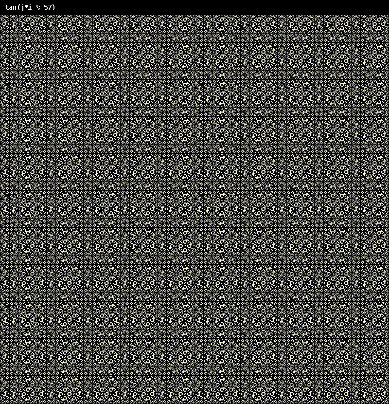

**What you see:** Similar textile texture but with a different tile size and different internal structure. The pattern appears almost like a tweed or herringbone weave.

**Why:** 57 = 3 x 19. The composite nature means the residue pattern has a richer factored structure than a prime modulus, creating the subtly different visual character.

---

### tan(j*i % 97)

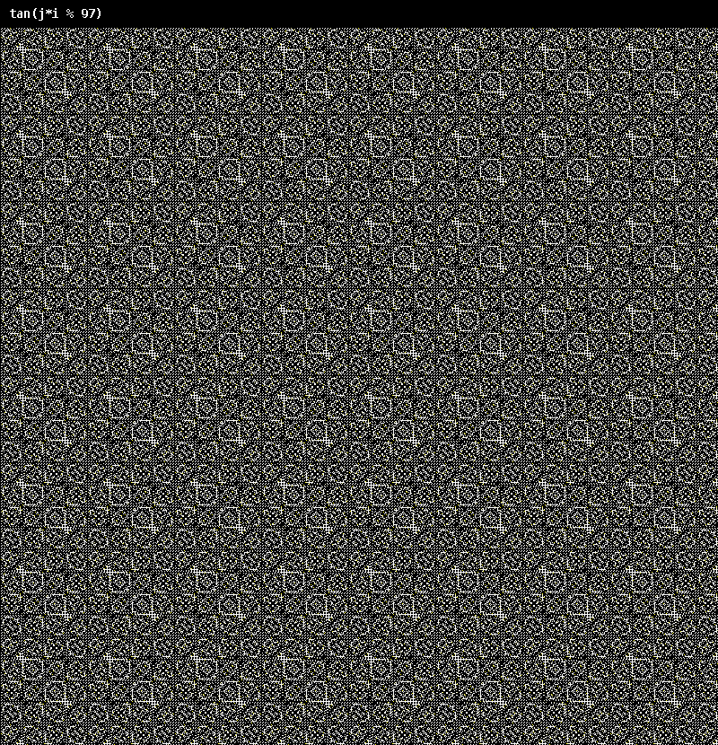

**What you see:** Finer-grained texture with larger tile blocks. The prime modulus 97 creates a clean, large repeat unit.

---

### tan(j*i % 123)

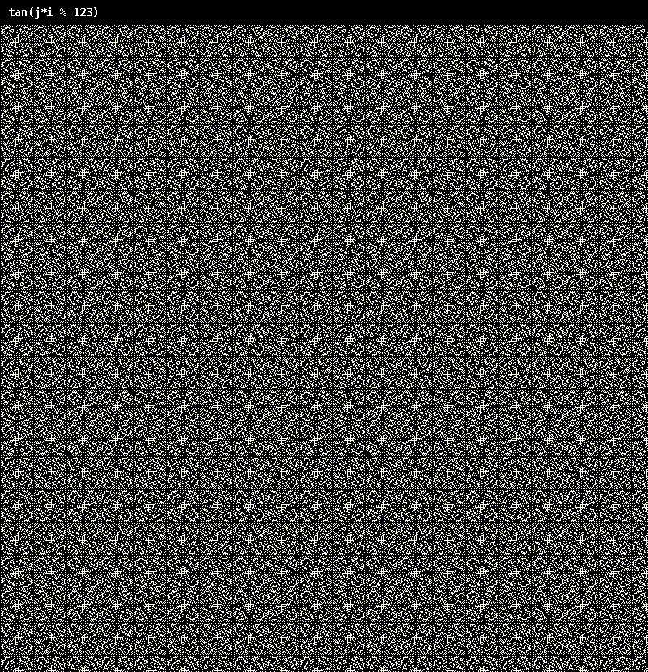

**What you see:** Large-scale tiling with visible rectangular super-blocks and internal fine detail. The 123 = 3 x 41 factorization creates a layered grid structure.

---

## Algorithm 1: Multiplication-Based Coloring

### Formula: `i * j` (raw, as RGB color)

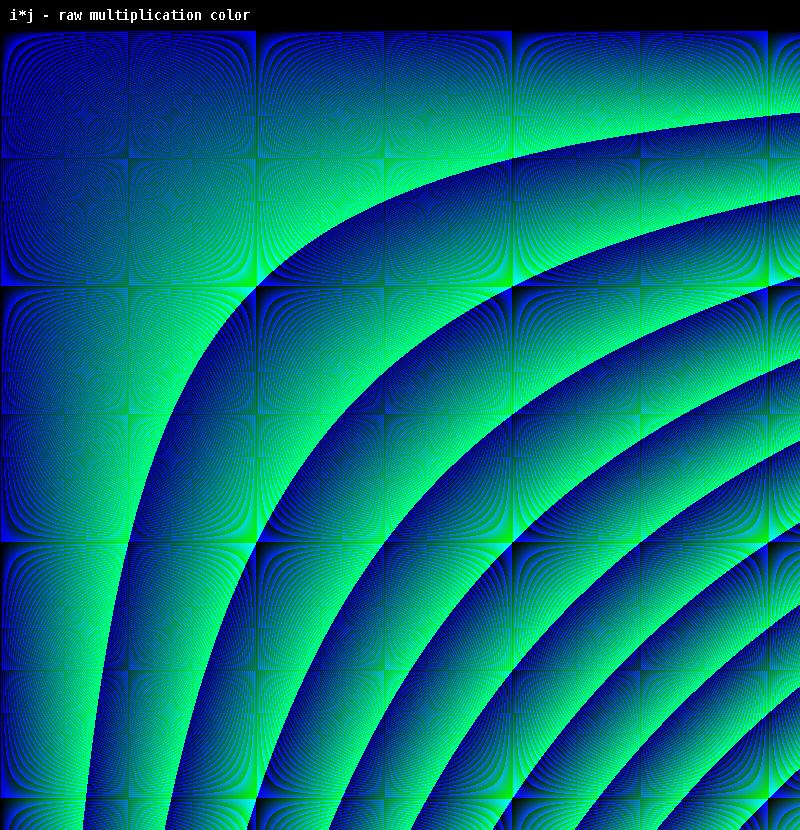

**What you see:** Smooth, sweeping hyperbolic curves radiating from the origin corner, with a blue-green-cyan color gradient. This looks almost like a physics simulation of wave interference.

**Why:** The product `i * j` increases smoothly away from the axes. When interpreted as a 24-bit RGB value, the bits that control red, green, and blue channels flip at different thresholds of the product, creating the concentric color bands. The curves are exact hyperbolas: `i * j = constant`.

---

### Formula: `i*i * j*j * 3 % modValue == 0` (red if true, black if false)

This binary formula is where things get really interesting. The question is simple: "Is `i^2 * j^2 * 3` divisible by the modulus?" The answer creates surprisingly rich patterns.

### mod 3: Almost entirely red

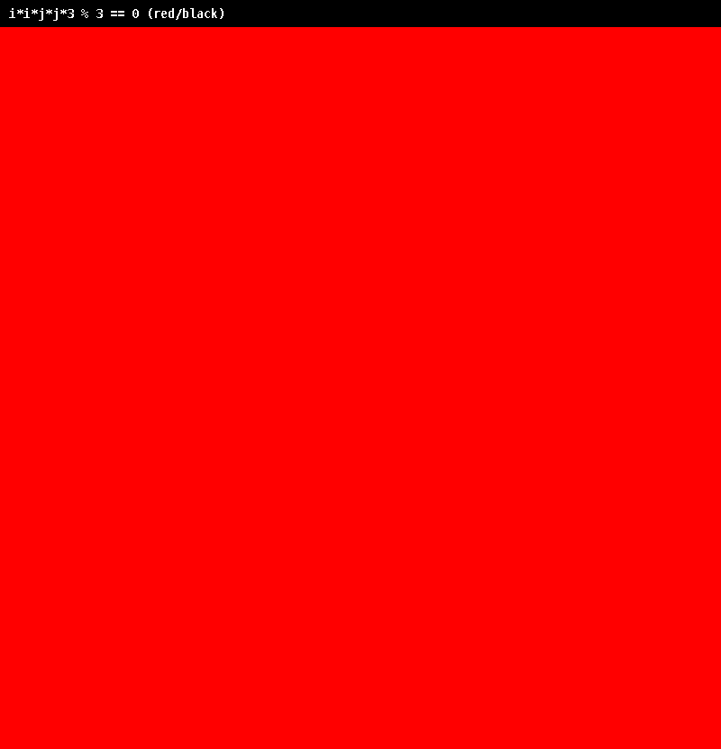

**What you see:** Nearly solid red. Almost every pixel satisfies the divisibility condition.

**Why:** Since the formula already multiplies by 3, the `% 3 == 0` condition is trivially satisfied for any `i * j` — the factor of 3 is already built in. Only pixels where `i` or `j` is 0 would show black on the axes, but the squared terms and the multiplier make it nearly universal.

---

### mod 5

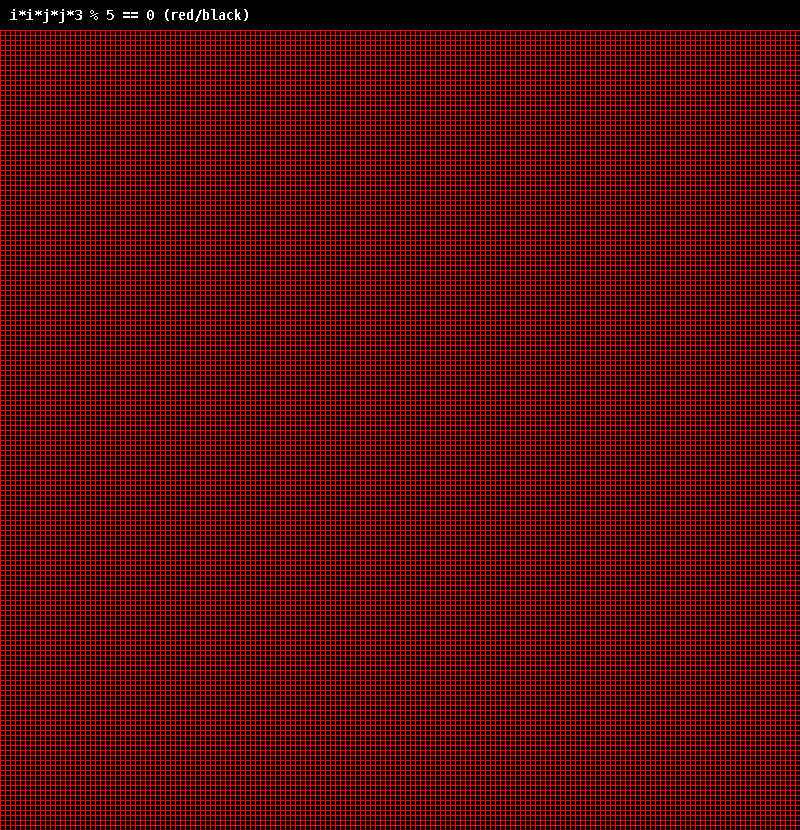

**What you see:** A dense red grid on black background. Thin black lines are visible, creating a mesh pattern.

**Why:** The black pixels occur where `i^2 * j^2 * 3` is NOT divisible by 5. Since 3 and 5 are coprime, this depends purely on whether `i` or `j` have factors of 5. The grid lines appear at multiples of 5.

---

### mod 10

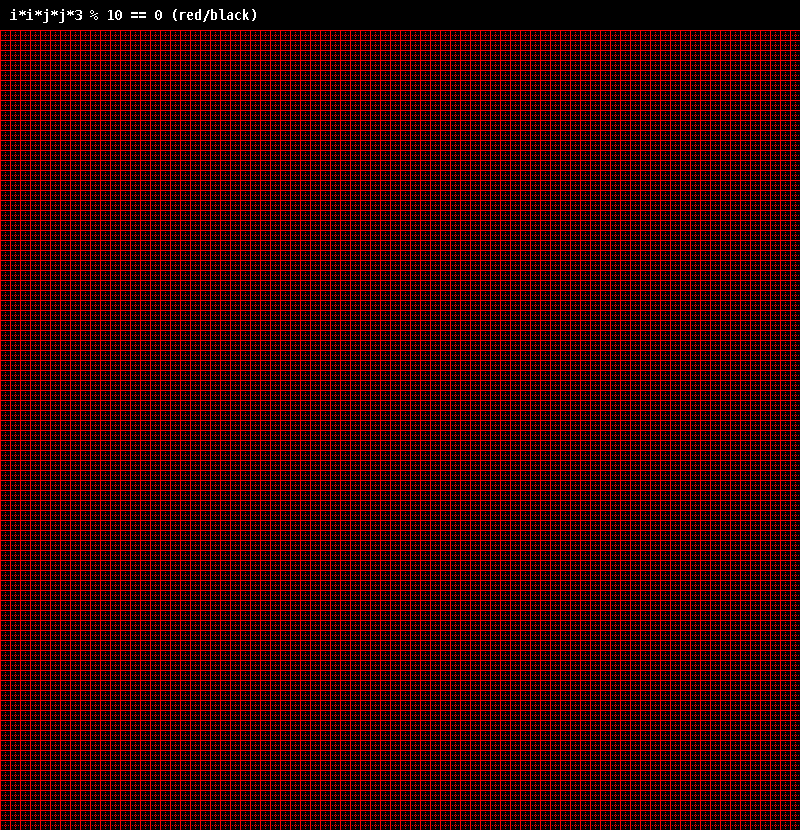

**What you see:** A finer grid pattern with both thin lines (from the factor-5 component) and a visible sub-grid texture (from the factor-2 component).

**Why:** 10 = 2 x 5. The divisibility condition combines the patterns from both prime factors, creating a composite grid with two different spacings overlaid.

---

### mod 23

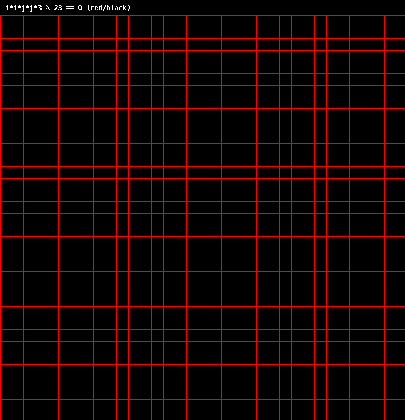

**What you see:** A striking grid of black rectangles on red, with clear prime-spaced lines creating a clean, regular lattice.

**Why:** 23 is prime, so the grid spacing is exactly 23 pixels. The squared terms create wider lines at multiples of 23, and the prime nature means there are no sub-patterns — just clean 23-pixel spacing.

---

### mod 25

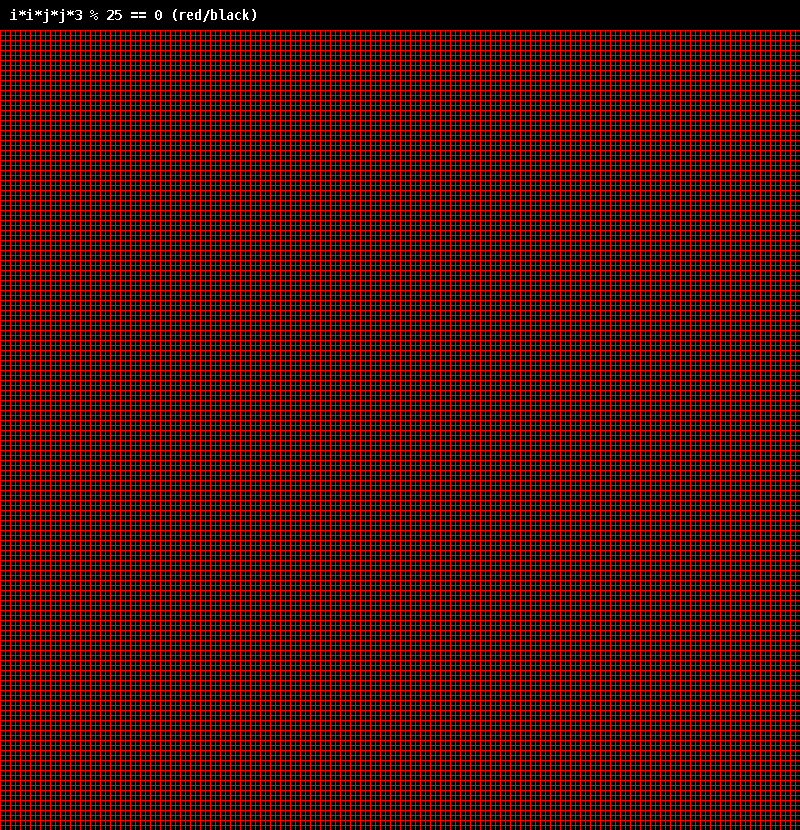

**What you see:** Dense red-on-black mesh with a complex layered grid. Visibly different from mod 23.

**Why:** 25 = 5^2. The perfect square modulus creates additional divisibility at multiples of 5 (not just 25), giving the pattern its layered quality — thin lines at multiples of 5 and thicker structures at multiples of 25.

---

### mod 35

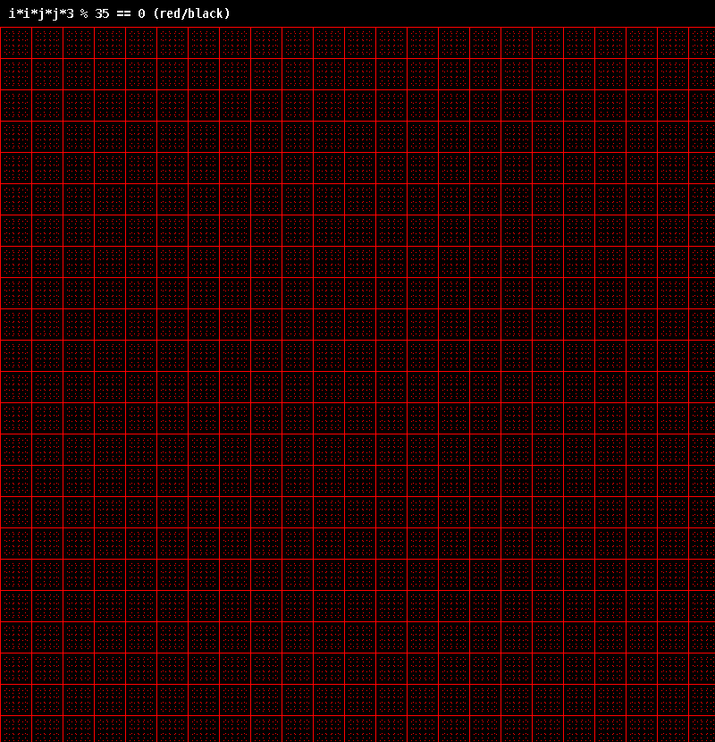

**What you see:** A beautiful grid-of-grids pattern. Small black rectangles are organized into larger rectangular blocks, creating a clearly hierarchical structure.

**Why:** 35 = 5 x 7. The two prime factors create grids at two different spacings (5 and 7), and their interaction creates the nested block structure. This is one of the most visually appealing patterns because the two scales are close enough to interact but different enough to be visible.

---

## Bonus Patterns

### XOR: `(i ^ j) % 64` — Sierpinski-like

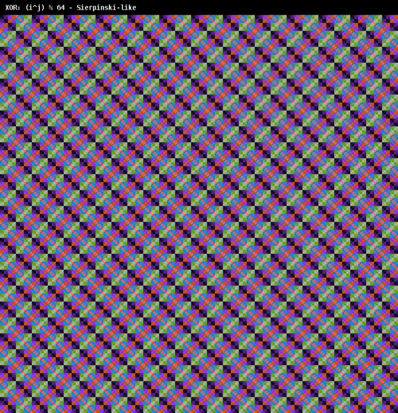

**What you see:** A colorful, repeating diagonal plaid pattern with self-similar structure.

**Why:** XOR on pixel coordinates famously produces Sierpinski triangle-like fractals. The modulo 64 (a power of 2) keeps the self-similarity clean, and the color mapping creates the distinctive plaid look. Each quadrant is a scaled copy of the whole — classic fractal self-similarity.

---

### XOR: `(i ^ j) % 256` — Fractal Carpet

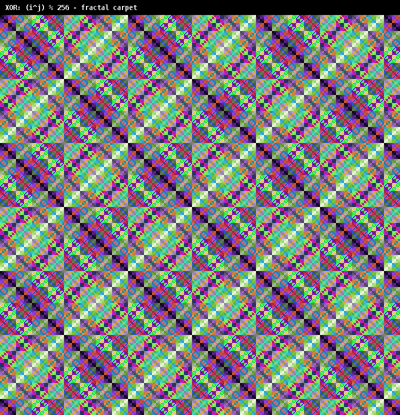

**What you see:** A stunning fractal carpet with nested diamond and triangular structures at multiple scales. Rich, varied colors throughout.

**Why:** The larger modulus (256 = 2^8) allows 8 levels of binary self-similarity to manifest. This is the XOR fractal at full resolution — every sub-square is a miniature copy of the larger pattern, with color variations creating depth. This is essentially a colorized Sierpinski triangle rendered through bitwise operations.

---

### Polar Spiral: `tan(angle * mod + distance / 10)` — mod=8

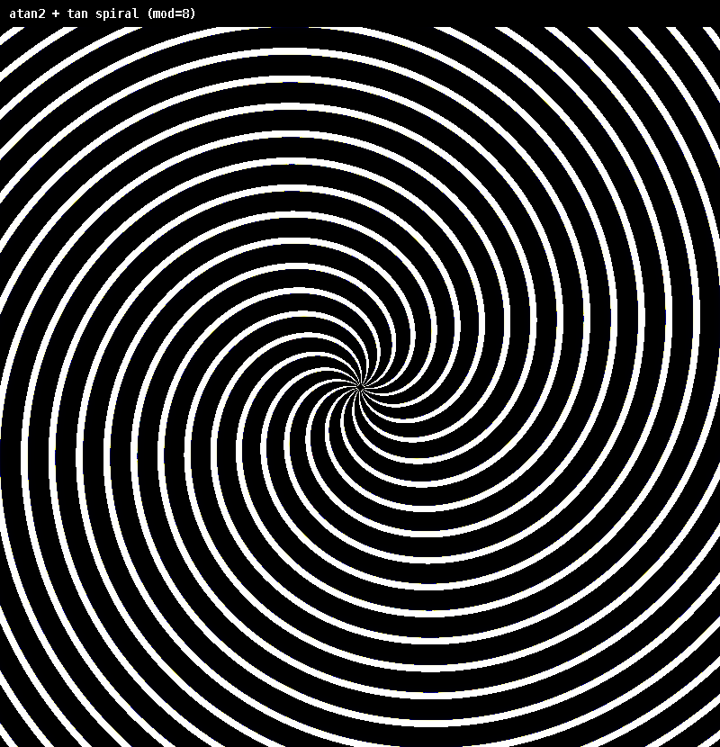

**What you see:** A hypnotic black-and-white spiral pattern radiating from the center — an optical illusion that appears to rotate.

**Why:** The formula converts Cartesian coordinates to polar (angle + distance from center), then applies tangent. The `mod=8` creates 8 spiral arms. The tangent function's poles create the sharp black/white boundaries, and the linear distance term causes the spiral arms to tighten toward the center.

---

### Polar Spiral: `tan(angle * mod + distance / 10)` — mod=23

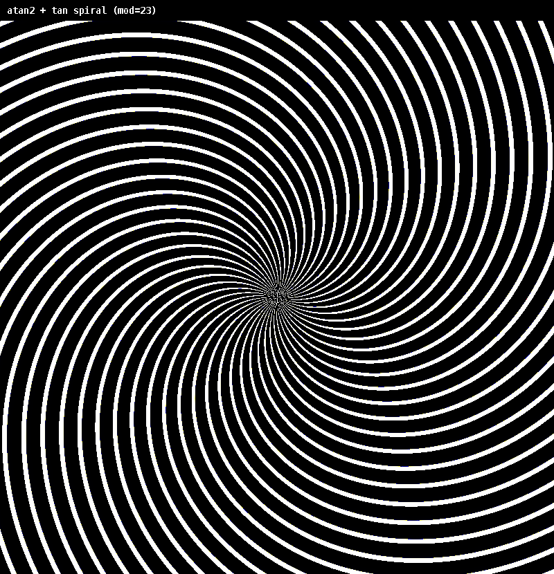

**What you see:** A denser spiral with 23 arms, creating a fine-grained radial pattern that resembles a natural pattern like a sunflower or nautilus shell cross-section.

---

## How to Run

### Original Interactive Version
```bash
# Compile and run from the surpriseimages package:
java -classpath . Paints 0       # Algorithm 0, no modulo
java -classpath . Paints 0 57    # Algorithm 0, mod 57
java -classpath . Paints 1 23    # Algorithm 1, mod 23
java -classpath . Paints 2       # Baseline: just solid red
```

### Headless Image Generator
```bash
javac PaintsGenerator.java
java -Djava.awt.headless=true PaintsGenerator
```

## Key Takeaway

A single line of arithmetic on pixel coordinates — `tan(j*i%57)`, `i*i*j*j*3%23==0`, or `(i^j)%256` — can produce patterns that look like they require sophisticated algorithms. The complexity isn't in the code; it's in the mathematics of number theory, modular arithmetic, and trigonometric functions interacting with the integer grid of pixel space.

This is emergence at its purest: simple rules, complex results. The same principle underlies cellular automata, crystal growth, and many natural patterns. The `Paints` program is a playground for discovering these hidden structures.
